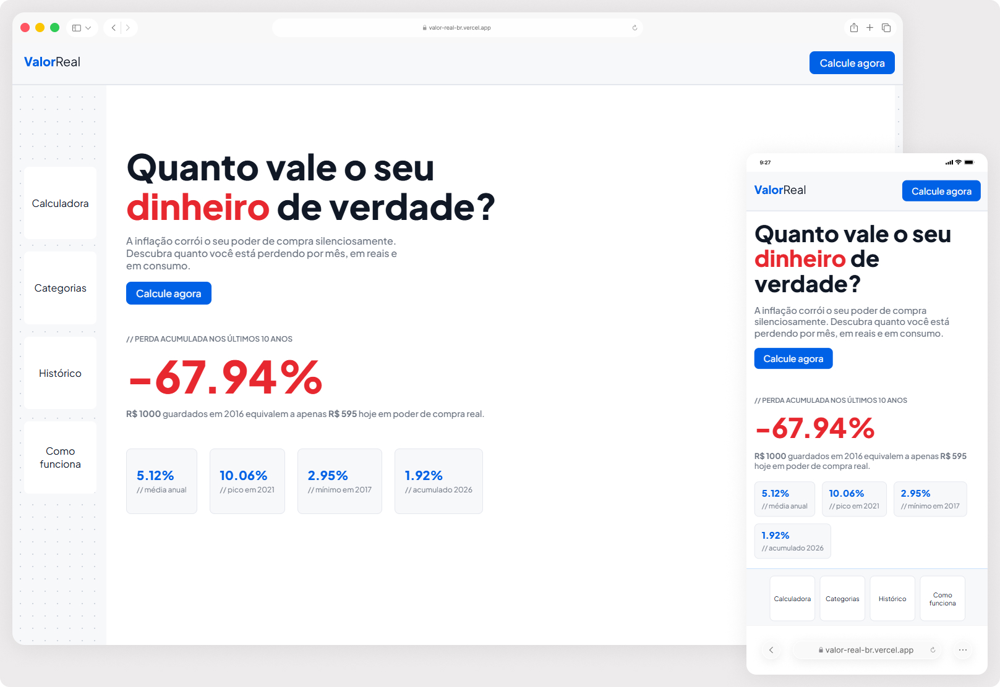

# valorReal

Visualize a inflação no Brasil com dados oficiais do Banco Central e IBGE. Compare a evolução dos últimos 10 anos e entenda o impacto real no seu poder de compra por categoria de consumo.

🔗 **[valor-real-br.vercel.app](https://valor-real-br.vercel.app)**


## Sobre o projeto

O valorReal nasceu de uma pergunta simples: quanto vale o seu dinheiro de verdade? A inflação corrói o poder de compra silenciosamente, este projeto torna esse impacto visível, em reais e em consumo concreto.

Não há números inventados. Todos os dados vêm diretamente das APIs oficiais do governo brasileiro, atualizados automaticamente.


## Funcionalidades

- **Home** - perda acumulada do IPCA nos últimos 10 anos com animação, média anual, pico e mínimo histórico
- **Histórico** - gráfico de barras com o IPCA ano a ano, colorido por faixa de intensidade
- **Categorias** - inflação por categoria (alimentação, habitação, transportes, saúde, educação) nos últimos 12 meses
- **Calculadora** - simule o impacto da inflação no seu orçamento por categoria, com projeção futura e equivalência em produtos do dia a dia


## Tecnologias

**Frontend**
- React
- Vite
- Recharts
- CSS Modules
- React Router DOM

**Backend**
- Node.js
- Express
- API do Banco Central (série 433 — IPCA)
- API do IBGE SIDRA (agregado 7060)

**Deploy**
- Vercel (frontend + serverless functions)


## Arquitetura

O projeto é dividido em dois módulos:

```
valorReal/
├── client/         # React + Vite
│   ├── src/
│   ├── api/        # Vercel Serverless Functions
│   └── services/   # Lógica de consumo das APIs externas
└── server/         # API REST com Express (referência local)
    ├── routes/
    └── services/
```

Em produção, as rotas do servidor são substituídas por **Vercel Serverless Functions** na pasta `api/`, eliminando a necessidade de infraestrutura de servidor dedicada. O módulo `server/` documenta a API REST original construída com Express.


## Rodando localmente

### Pré-requisitos
- Node.js 18+

### Server
```bash
cd server
npm install
node index.js
```
O servidor sobe na porta `3001`.

### Client
```bash
cd client
npm install
npm run dev
```

Crie um arquivo `.env` dentro de `client/`:
```
VITE_API_URL=http://localhost:3001/api
```


## Fontes de dados

| Dado | Fonte |
|---|---|
| IPCA mensal e anual | [api.bcb.gov.br](https://api.bcb.gov.br) — série 433 |
| Inflação por categoria | [servicodados.ibge.gov.br](https://servicodados.ibge.gov.br) — SIDRA agregado 7060 |


## Preview
